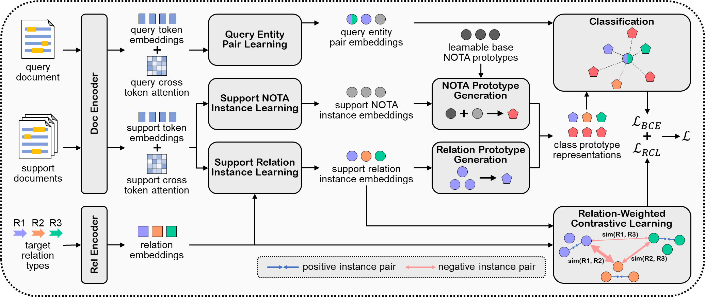

# RAPL: Relation-Aware Prototype Learning for Few-Shot DocRE

This repository contains the data, code and trained models for paper [RAPL: A Relation-Aware Prototype Learning Approach for Few-Shot Document-Level Relation Extraction](https://arxiv.org/abs/2310.15743).

## Quick Links

- [Overview](#Overview)
- [Setup](#Setup)
  - [Install dependencies](#Install-dependencies)
  - [Trained models](#Trained-models)
- [Datasets](#Datasets)
  - [FREDo](#FREDo)
  - [ReFREDo](#ReFREDo)
- [Quick Start](#Quick-Start)
- [Citation](#Citation)

## Overview



In this work, we present a relation-aware prototype learning method (RAPL) for few-shot document-level relation extraction. We reframe the construction of relation prototypes into instance level and further propose a relation-weighted contrastive learning method to jointly refine the relation prototypes. We also design a task-specific NOTA prototype generation strategy to better capture the NOTA semantics in each task.

You can find more details of this work in our [paper](https://arxiv.org/abs/2310.15743).

## Setup

### Install dependencies

To run the code, please install the following dependency packages:

- apex
- numpy
- opt_einsum
- torch
- tqdm
- transformers
- wandb

### Trained models

We release the sample trained models for each task setting on [Tsinghua Cloud](https://cloud.tsinghua.edu.cn/d/ea949a7000b64fb9a7f8/). To reproduce the results in the paper, you can download the corresponding models and place them in [checkpoints](checkpoints) directory.

## Datasets

Our experiments are based on two benchmarks: FREDo and ReFREDo, and all relevant data files are located in [dataset](dataset) directory.

### FREDo

FREDo is a few-shot document-level relation extraction benchmark consisting of two main tasks (in-domain / cross-domain) with a 1-Doc and a 3-Doc subtask each. The relevant data files include:

- dataset/[train_docred, dev_docred, test_docred, test_scierc].json contain all annotated documents used for training and testing.
- dataset/[test_docred_1_doc_indices, test_docred_3_doc_indices, test_scierc_1_doc_indices, test_scierc_3_doc_indices].json contain sampled episodes (only the indices of the documents and which relations are to be annotated/extracted).

### ReFREDo

ReFREDo is a revised version of FREDo, which replaces the training, development and in-domain test document corpus with Re-DocRED, leading to more complete annotations. The relevant data files include:

- dataset/[train_redocred, dev_redocred, test_redocred, test_scierc].json contain all annotated documents used for training and testing.
- dataset/[test_redocred_1_doc_indices, test_redocred_3_doc_indices, test_scierc_1_doc_indices, test_scierc_3_doc_indices].json contain sampled episodes (only the indices of the documents and which relations are to be annotated/extracted).

## Quick Start

In [scripts](scripts) directory, we provide the example scripts for running experiments under each task setting. For example, you can use the following command to run the trained model on in-domain 3-Doc test tasks in ReFREDo benchmark:

```bash
sh scripts/refredo_indomain_3doc.sh
```

You can also comment the `--load_checkpoint` argument and set `--num_epochs` argument to 25 for training. The following command can be used to display the details about each argument:

```bash
python src/main.py -h
```

## Citation

Please kindly cite our paper if you use the data, code or models of RAPL in your work:

```bibtex
@article{meng2023rapl,
  title={RAPL: A Relation-Aware Prototype Learning Approach for Few-Shot Document-Level Relation Extraction},
  author={Meng, Shiao and Hu, Xuming and Liu, Aiwei and Li, Shu'ang and Ma, Fukun and Yang, Yawen and Wen, Lijie},
  journal={arXiv preprint arXiv:2310.15743},
  year={2023}
}
```

